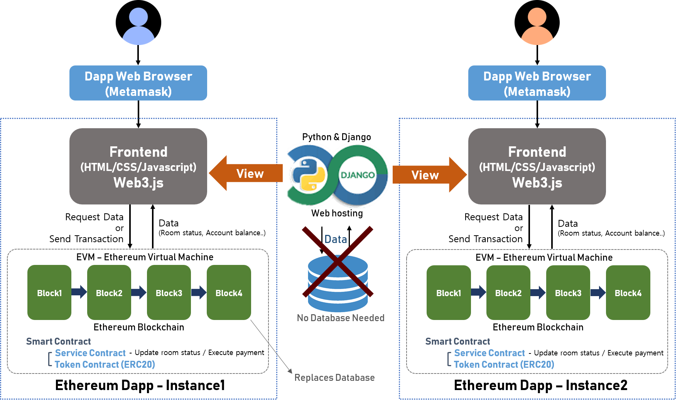
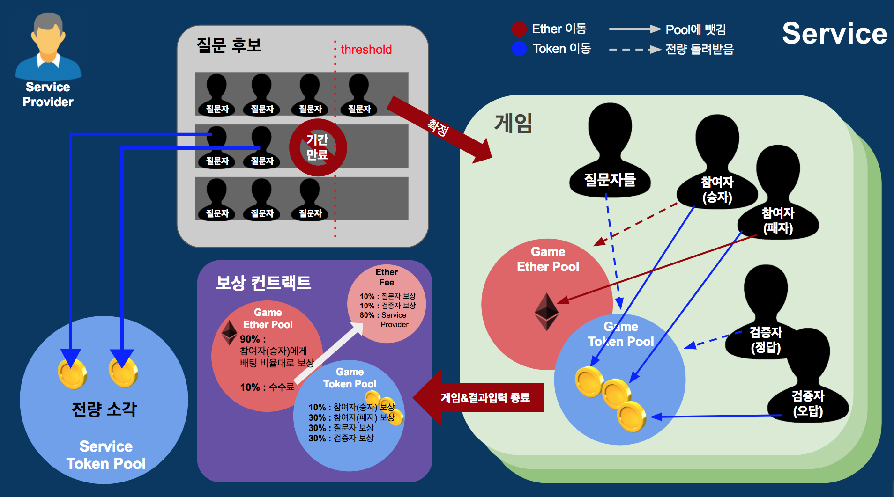

# Scotto
Decentralized soccer score prediction application based on Ethereum Smart Contract

## Requirement
```
$ pip3 install Django
$ pip3 install django-bootstrap3
```

## How to run
```
$ cd dApp
$ python3 manage.py makemigrations
$ python3 manage.py migrate
$ python3 manage.py runserver
```

## 기본 Concept
게임 생태계 활성화를 위해 faucet을 통하여 신규 참여자에게 10 token씩 무료 분배

### 질문자, 참여자, 결과 입력자 존재

1. 경기 시작 7일 이전부터 4일 동안 사람들(질문자)이 스마트 컨트랙트 상에 일정 량의 토큰을 담보로 걸고 경기 입력
ex ) 2018.2.8 20:00 축구 경기 한국 vs 중국 →  2018.2.1 20:00 ~ 2018.2.5 20:00까지 경기 입력

2. 같은 경기에 대해 일정 참여율 이상 발생하면 스마트 컨트랙트는 해당 경기가 실제 존재하는 것으로 인식 후 확정.
    - 참여율 기준 : (전체 유통되고 있는 토큰의 2.5%) && (질문자 20명 이상)
    - 한 계좌 당 담보로 거는 토큰의 최소량 : 전체 유통되고 있는 토큰의 0.05%
3. 참여자들은 확정된 경기에 대해 예상 결과(승, 무, 패) 입력 후 이더리움 배팅.

4. 기간이 지난 후 결과 입력자들이 일정량의 토큰(플랫폼 내 자체 코인)을 담보로 걸고 결과 입력, 결과는 다수결(지분)로 결정. 결과 입력자중 소수는 담보를 돌려받지 못하고, 다수는 담보를 돌려받고 추가 보상

5. 승자에게 배팅된 이더리움 + 토큰 보상, 틀린 사람들은 배팅한 이더리움을 잃지만 토큰 보상.

#### 오라클 문제
```
오라클 문제란 현실에서 벌어진 데이터를 블록체인 상에 기록할 때 그 데이터를 어떻게 신뢰할 지에 관한 문제

중앙 집권화 된 조직이라면 특정 주체가 바로 결정하겠지만, 탈 중앙화 어플리케이션에서는 경제적 유인을 가진 플레이어들이 자발적으로 참여하여 합의를 통해서 결과를 도출
```

## Details
### 질문자
- 질문 생성 시 전체 유통되고 있는 토큰의 0.05% 이상의 토큰을 담보로 지불
- 질문 확정 시 토큰 보상 + 지불한 토큰 반환, 질문이 확정되지 않으면 지불한 토큰 중 일부 회수
- 효과 : 무분별한 질문(존재하지 않는 경기 or 사람들이 관심이 없는 소규모 경기 등) 생성 억제

##### 질문 확정 시 보상
```
1. 승자 보상에서 걷은 이더리움 수수료의 10% 담보 토큰 비율에 따라 보상
2. (참여자가 배팅한 토큰 + 잘못된 결과 입력자가 담보로 걸은 토큰) 의 30%을 담보 토큰 비율에 따라 보상
    - 확정되지 않은 질문에 담보로 걸린 토큰은 소각
```

### 참여자
- 이더리움 + 토큰(선택) 배팅
##### 승자  
    - 배팅한 이더리움 + 배팅한 이더리움량에 비례한 이더리움 보상 + 토큰 보상
    - 배팅한 토큰량에 비례한 보너스 이더리움 보상

##### 패자
    - 이더리움 회수 + 토큰 보상
      → 토큰을 보상으로 줌으로써 플랫폼 내 토큰 유통량 증가, 패자에게 서비스 재이용 동기 부여 및 유저 수 확보

##### 보상
1. 이더리움 보상
Ex) 패자가 배팅한 이더 총액에서 수수료 10%를 제외한 이더리움 X개, 승자 A가 (2ETH, 10token), B가 (3ETH, 15token), C가 (5ETH, 5token) 배팅

    - X의 95%는 이더리움 배팅량에 비례하여 보상 A : 0.95 * X * 0.2 ETH B : 0.95 * X * 0.3 ETH C : 0.95 * X * 0.5ETH

    - X의 5%는 토큰 배팅량에 비례하여 보상 : A : 0.05 * X * 10/30 ETH B : 0.05 * X * 15/30 ETH  C : 0.05 * X * 5/30 ETH

    | 보상비율 | A | B | C | 계 |
    |--------|---|---|---|---|
    |ETH 배팅량에 비례한 이더리움 보상	|0.95*X*(2/10)|0.95*X*(3/10)|0.95*X*(5/10)|0.95*X|
    |토큰 배팅량에 비례한 이더리움 보상|0.05*X*(10/30)|0.05*X(15/30)|0.05*X*(5/30)|0.05*X|
    |계||||	 	 	 	X


2. 토큰 보상

- 승자 : (모든 참여자가 배팅한 토큰 + 잘못된 결과 입력자가 담보로 걸은 토큰)의 10%을 배팅한 토큰에 비례하여 분배

- 패자 : (모든 참여자가 배팅한 토큰 + 잘못된 결과 입력자가 담보로 걸은 토큰)의 30%을 배팅한 토큰에 비례하여 분배

    → 토큰을 보상으로 줌으로써 플랫폼 내 토큰 유통량 증가, 패자에게 서비스 재이용 동기 부여 및 유저 수 확보

### 결과 입력자
- 지분 증명
    - 질문 참가자를 제외한 사람들 중 토큰 보유자들에게 18시간동안 결과 입력 기회 제공
    - 각자 자신의 토큰을 담보로 걸고 결과 입력. 토큰은 여기서 지분 역할.
    - 많은 지분이 걸린 결과가 정답으로 채택, 입력자들에게 토큰 보상. 틀린 답을 입력한 사람들의 담보는 회수

- 탈중앙화를 위한 보상 체계
    - 지분 증명의 전제 : 토큰을 많이 보유한 사람들은 플랫폼 내 토큰의 가치 보존을 위해 올바른 입력을 할 것

##### 보상
1. 올바른 결과 입력자에게 (참여자가 배팅한 토큰 + 잘못된 결과 입력자가 담보로 걸은 토큰)의 30%을 담보로 걸은 토큰에 비례하여 분배
2. 승자 보상에서 걷은 이더리움 수수료의 10% 담보로 걸은 토큰에 비례하여 분배

### Penalty
- 질문자 : 확정되지 않은 질문 생성 시 담보로 지불한 토큰 회수 → 사람들의 무분별한 질문 생성 방지
- 결과 입력자 : 잘못된 결과 입력 시 담보로 지불한 토큰 회수 → 입력된 결과의 신뢰성 유지

### 질문 & 답변 타입
- 질문 : 경기 종류, 경기 날짜, 팀(A vs B) 입력
- 답변 : A팀 기준 승, 무, 패
→ 고정된 형식을 지정함으로써 스마트 컨트랙트 상에서 형식을 벗어난 입력이 들어오면 트랜잭션 거절


### BM
- 승자에게 이더리움 상금을 보상으로 지급 시 10% 수수료로 회수 후 그 중 10% 씩 질문자, 결과입력자에게 분배. 80%를 수익으로 환원
- 승자가 없는 경우 배팅된 이더리움 전부 회수

### 차별화 포인트
- 기존의 거대한 ICO를 진행한 탈중앙화 예측 시장 플랫폼(augur, gnosis, bodhi) 등은 주제 선정에 제한이 없음.
- 우리의 어플리케이션은 스포츠 경기 결과라는 한정된 주제 내에서 예측 시장을 구성하여 사용자들의 선택과 집중을 유도
- 기존 스포츠 경기 결과 예측 서비스의 문제점 해결
  - 기존 사설 서비스의 경우 사람들이 게임에 건 돈을 들고 주최측이 도망가는 경우가 굉장히 빈번. 하지만 탈중앙화된 스마트 컨트랙트를 이용할 경우 사기의 가능성 원천 봉쇄
→ 기존 서비스의 신뢰성에 의문을 품은 사용자들에게 큰 관심 유도 가능
- 정부 공식 스포츠 토토의 200만원 이상 적중될 경우 22%라는 막대한 세금 부과
- 홈페이지 메인에 서비스 이용자들의 단체 채팅 기능 구현 → 유저들의 토론과 합의의 장 마련

### 한계 및 각종 이슈
1. 이더리움 수수료의 문제
모든 스마트 컨트랙트 내 트랜잭션 발생 시 이더리움 수수료 발생. 수수료가 너무 과할 경우 이용자에게 서비스를 이용할 동기 부여가 충분하지 못할 가능성 존재.
→ 이더리움 측에서 수수료를 낮추기 위한 각종 해결방안을 마련하고 있으며 언젠가는 해결이 될 것(이라고 예상)
2. 스포츠 예측 시장의 문제(출처 : https://steemit.com/coinkorea/@piljae/augur)
    - 합법적인 곳에서는 시장에 많은 플레이어들이 존재, 엄청난 돈을 벌며 고객이 원하는 최적의 서비스를 이미 제공중. 규모가 있는 업체는 도망가지도 않고 이미 고객들에게 많은 신뢰를 얻고 있으며 유저들은 불편함을 느끼지 않고 있기 때문에 탈중앙화 앱을 이용하여 이더리움을 구매하고 서비스를 사용할 이유가 없다.
    - 불법적인 곳에서는 이 또한 불법일 가능성이 높다. 우리나라에서는 정부가 운영하는 정식 사이트를 제외하고는 모두 불법으로 간주. 이런 정책적인 문제 때문에 갬블링을 불법으로 여기는 많은 나라에서 가상화폐를 통한 예측시장 또한 불법으로 여길 가능성 존재.
    - 치명적인 사용성. ex) 경기결과가 나오고도 합의 과정을 거쳐 완료되어야만 배당금을 받을 수 있다. 하지만 기존의 시스템의 경우는 축구 휫슬이 울리자마자 계좌에 당첨금이 들어옴.

### System Architecture


### Compensation Structure

